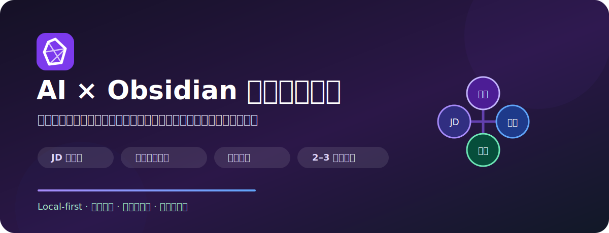
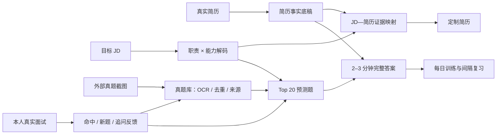

<div align="center">
  

  <p>
    
    
    
    
    
  </p>

  <p><strong>把简历、JD、外部真题、每日训练和真实面试反馈，连接成一座会持续生长的本地求职知识库。</strong></p>

  <p>
    <a href="#-30-秒开始">30 秒开始</a> ·
    <a href="#-它如何生长">工作原理</a> ·
    <a href="#-核心能力">核心能力</a> ·
    <a href="#-安全升级">安全升级</a> ·
    <a href="#-致谢与引用">致谢与引用</a>
  </p>
</div>

---

## 为什么做这个项目

大多数 AI 面试准备停留在一次性对话：贴一份 JD、生成几十道题、复制到文档，然后很快失去上下文。

这个 Skill 把整个过程变成一套长期系统：

| 常见问题 | 本项目的处理方式 |
|---|---|
| JD 拆解很长，职责与能力重复 | 合并成“职责 × 能力”核心表，岗位页保持精简 |
| 一份简历投所有岗位 | 建立唯一事实底稿，每个 JD 生成独立定制版本 |
| AI 为了匹配岗位编造经历 | 只允许已确认事实进入行为题和定制简历 |
| 问题和答案分开放，查找困难 | 问题文字直接链接独立答案页 |
| 面试题预测缺少真实依据 | 同时使用 JD、外部真题和本人面试反馈 |
| 小红书/牛客截图难以长期复用 | 保留原图与来源，OCR 拆题、去重、生成答案并回流预测 |
| 每次换公司都从零开始 | 故事、能力和同岗位真题跨 JD 复用 |
| 模板升级容易覆盖个人内容 | 只升级系统文件，先备份，个人笔记永不覆盖 |

## 🌱 它如何生长



预测证据有明确优先级：

```text
本人同公司/同岗位真实面试
          ↓
同公司/同岗位外部真题
          ↓
相同或相近岗位族真题
          ↓
JD Must Have / Hidden Signals / 简历风险
```

外部平台题目只标记为“用户转述真题”，不会冒充公司官方题库。

## ✨ 核心能力

| 模块 | 你会得到什么 |
|---|---|
| 📄 简历事实底稿 | 从 PDF、Word、文本或截图中整理可验证事实、数字来源和个人贡献边界 |
| 🎯 JD 解码 | Base、薪资、职责 × 能力、硬门槛、隐性信号、投递风险 |
| 🧩 定制简历 | JD—简历逐项映射、已覆盖/弱覆盖/未覆盖、不建议硬凑、独立版本 |
| 🧠 BQ Story Bank | 使用 STAR/CAR 从真实经历建立可跨题复用的故事库 |
| ❓ 面试题预测 | 必练、次重点、补充三级 Top 20；题目点击即看答案 |
| 🗂 真题库 | 图片 OCR、来源保留、语义去重、按岗位归纳、出现次数统计 |
| 🎙 完整答案 | 回答策略、个性化内容和可直接口述的 2–3 分钟完整答案 |
| 🔁 反馈校准 | 记录预测命中与预测外新题，持续调整后续岗位准备优先级 |
| 📅 每日训练 | 到期旧题 + 2–3 道新题，一次只问一题，回答后再反馈 |

## 🚀 30 秒开始

### 方式 A：让 Codex 安装并创建（推荐）

将仓库地址发给 Codex：

```text
请安装这个 Skill：
https://github.com/<your-name>/obsidian-interview-growth-vault
```

安装后新建对话：

```text
使用 $obsidian-interview-growth-vault，
在“D:/Obsidian/面试自生长库”创建一套新的面试准备库。
```

Codex 会调用安全安装器、创建完整目录，并引导你打开 `00 首页.md`。

### 方式 B：直接运行安装脚本

```bash
git clone https://github.com/<your-name>/obsidian-interview-growth-vault.git
cd obsidian-interview-growth-vault

python scripts/install_vault.py \
  --target "/absolute/path/to/my-interview-vault" \
  --mode create
```

`create` 模式只接受新目录或空目录，避免误写已有文件。

## 🧭 第一次使用

安装后依次完成：

1. 用 Obsidian 打开目标文件夹。
2. 启用核心插件 **模板** 和 **日记**。
3. 建议安装 **Dataview**；若希望在 Obsidian 内运行模板命令，再安装 **Templater**。
4. 把原始简历放进 `07 简历库/原始文件`。
5. 对 Codex 说：

```text
使用 $obsidian-interview-growth-vault，读取我的简历，
建立简历事实底稿。没有证据的内容不要补写，一次只问我一个问题。
```

6. 之后可以直接发送 JD 文本、网页剪藏、岗位截图或面试题截图。

## 🗣 常用指令

### 导入新 JD

```text
使用 $obsidian-interview-growth-vault 完整处理这份 JD：
归档原文、提取 Base 和薪资、精简拆解、匹配简历、创建定制版本，
并结合真题库生成 Top 20 面试题与独立答案。
```

### 导入小红书等平台真题

```text
把这些截图作为外部真题处理：保留原图和来源，忠实 OCR，
按考察点拆题并全库去重，先生成答案，再回流对应岗位预测。
```

### 记录真实面试

```text
整理这次真实面试。保留原题、追问、我的原回答和卡点，
并标记哪些题预测命中、哪些是预测外新题。
```

### 今日模拟

```text
开始今日模拟面试：2 道到期旧题 + 2–3 道新题。
一次只问一道，在我回答前不要展示答案。
```

## 🗃 库结构

```text
面试自生长库/
├── 00 首页.md
├── 00 临时收集表/
├── 01 岗位库/              # JD、精简岗位分析、投递清单
├── 02 能力库/              # 能力定义与个人证据
├── 03 面试题库/            # 问题、真题来源、练习记录
├── 04 答案库/
│   ├── 题目答案/           # 一题一页，含完整口述答案
│   └── 故事库/             # STAR/CAR 行为故事
├── 05 面试记录/            # 真实面试与模拟面试原始记录
├── 06 每日训练/
├── 07 简历库/
│   ├── 原始文件/
│   └── 定制版本/
├── 98 附件/真题截图/
├── 99 模板/                # 11 个笔记模板
└── 99 系统/                # 工作流、字段与校准规则
```

Skill 自身包含 36 个脱敏的 Vault 文件；不会携带作者的简历、JD、真题或个人答案。

## 🛡 安全升级

先预览：

```bash
python scripts/install_vault.py \
  --target "/absolute/path/to/existing-vault" \
  --mode upgrade \
  --dry-run
```

确认后升级：

```bash
python scripts/install_vault.py \
  --target "/absolute/path/to/existing-vault" \
  --mode upgrade
```

升级规则：

- 只覆盖 `99 模板` 和 `99 系统` 中的托管文件。
- 覆盖前备份到 `_系统备份/<timestamp>`。
- 其他目录只补缺失文件，不覆盖已有内容。
- 不执行删除操作。
- 拒绝把文件系统根目录或用户主目录作为安装目标。

## 🔒 隐私与真实性

- 所有个人资料默认保存在用户自己的 Obsidian 文件夹。
- 不把参与经历自动改成“负责/主导”。
- 不编造公司、项目、数字、证书、工具或结果。
- 团队成果必须区分个人贡献。
- 行为题只能引用已确认事实和真实故事。
- OCR 看不清的部分标记“无法确认”，不猜测。
- 外部面经保留平台与原帖来源，但不视为公司官方题库。
- 匹配分只代表材料诊断，不代表 ATS、面试或录用概率。

## 🧱 项目结构

```text
obsidian-interview-growth-vault/
├── SKILL.md                    # Skill 触发条件与操作规则
├── README.md                   # 项目介绍与使用指南
├── THIRD_PARTY_NOTICES.md      # 上游项目与许可证说明
├── agents/openai.yaml          # Codex UI 元数据
├── scripts/install_vault.py    # 安全创建/升级安装器
├── references/vault-spec.md    # 数据与目录契约
└── assets/
    ├── readme/hero.svg
    └── vault-template/         # 36 个脱敏 Obsidian 文件
```

## 🙏 致谢与引用

本项目是独立组装的 Obsidian 工作流，但以下开源项目对方法设计有明确启发，因此主动标注：

| 项目 | 许可证 | 本项目的关系 |
|---|---|---|
| [coinluu/resume-jd-optimizer-cn](https://github.com/coinluu/resume-jd-optimizer-cn) | MIT | 借鉴 JD 优先、证据映射、贡献边界、ATS 可读性与拒绝编造原则；未捆绑其代码 |
| [yanliudesign/offer-toolkit-skill](https://github.com/yanliudesign/offer-toolkit-skill) | MIT | 借鉴 JD 解码、任务路由、STAR/CAR Story Bank、一次一问和 JD 驱动 BQ；未捆绑其代码 |
| [srbhr/Resume-Matcher](https://github.com/srbhr/Resume-Matcher) | Apache-2.0 | 相关简历/JD 产品参考；不是运行依赖，未复制其源码 |

完整说明见 [THIRD_PARTY_NOTICES.md](THIRD_PARTY_NOTICES.md)。

## 🤝 贡献

欢迎提交：

- 新岗位族的脱敏模板。
- 真题去重、反馈校准和复习算法改进。
- Obsidian 兼容性修复。
- 不包含真实联系方式或商业机密的演示截图。
- 安装器在 Windows、macOS 和 Linux 上的测试反馈。

提交 Issue 或 PR 前，请删除简历、手机号、邮箱、客户名称、未公开经营数据和平台私信截图。

## 📜 License

当前分享包尚未选择主项目许可证。在公开发布前，仓库所有者应根据期望的复用方式添加 `LICENSE`；如果希望允许他人自由使用、修改和分发，可考虑 MIT License。

第三方项目继续适用各自许可证；本项目的主许可证不会覆盖它们。

## ⚠️ 免责声明

本项目帮助整理求职材料和面试准备，不保证通过 ATS、获得面试或取得 Offer。所有输出都应由用户核验；涉及个人隐私、公司信息和外部平台内容时，请遵守适用法律、平台规则与保密义务。

